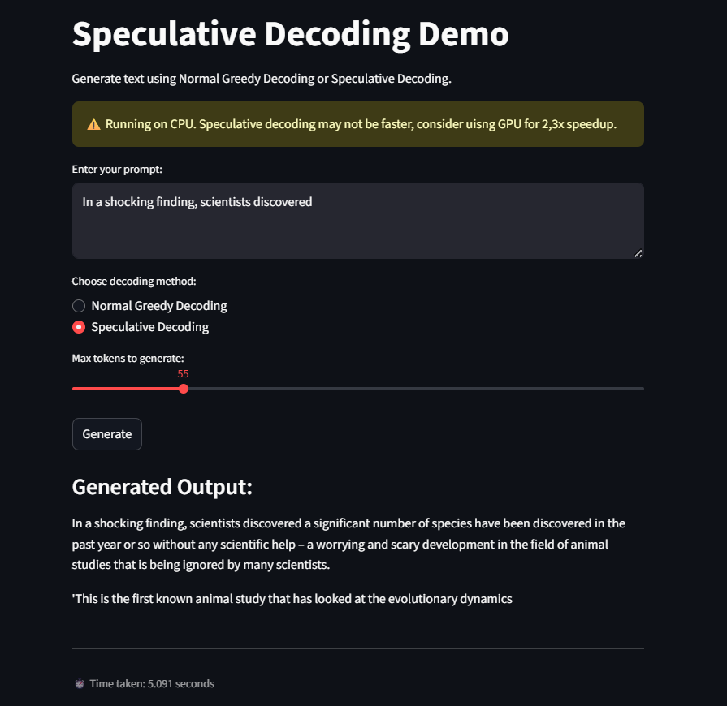

# ⚡ Speculative Decoding Demo — Faster Token Generation with Hugging Face

[](https://huggingface.co/transformers)
[](https://pytorch.org/)
[](https://streamlit.io)
[](https://www.python.org)
[](LICENSE)

An interactive **Speculative Decoding demo** built with Hugging Face Transformers, PyTorch, and Streamlit. It compares **normal greedy decoding** vs **speculative decoding** side by side — so you can see how speculative methods speed up token generation in Large Language Models. 🚀

---

## 🚀 Features

- Compare **Normal Greedy Decoding** vs **Speculative Decoding**
- Uses **two models**:  
  - Draft (small, fast) model  
  - Target (larger, accurate) model
- Measure and display **time taken** for both methods
- Simple **Streamlit UI** for user prompts
- Works on CPU (learning), but **real speedups appear on GPU**

---

## 🖼️ Screenshot

| Streamlit UI |
|--------------|
|  |

---

## 🧱 Tech Stack

- `Hugging Face Transformers`
- `PyTorch`
- `Streamlit`
- `Python 3.10+`

---

## 🛠️ Installation

```bash
git clone https://github.com/AshleyMathias/Speculative-Decoding.git
cd Speculative-Decoding
```

## Create a virtual environment

```bash
python -m venv venv
source venv/bin/activate  # or venv\Scripts\activate on Windows
```

## Install dependencies

```bash
pip install -r requirements.txt
```

## Run the Streamlit app

```bash
streamlit run main.py
```

---

## ✨ Sample Use Case
Learn and experiment with Speculative Decoding, a technique that allows faster generation in LLMs by letting a smaller draft model propose tokens that the larger target model verifies.

- Try prompts like:
  - Explain speculative decoding in simple words
  - Write a Python function for Fibonacci numbers
  - Tell me a fun fact about space

- Use it for:
  - Understanding modern LLM acceleration
  - Comparing generation strategies
  - Experimenting with Hugging Face + Streamlit


---

## 🤝 Contributing
Contributions, issues, and feature requests are welcome!

If you’d like to:

  - Suggest improvements
  - Report bugs
  - Add new features or UI elements

Feel free to fork the repository and submit a pull request.
Please follow clean commit practices and open issues with context.

Let’s learn and build together 🚀


---

<div align="center"> <br/> 🔗 Connect with me <a href="https://www.linkedin.com/in/ashleymathias10" target="_blank"></a>

<a href="mailto:ashleymathias100@gmail.com"></a>

<a href="https://github.com/AshleyMathias"></a>

<br/><br/>

---

<p align="center"> Built with 💻 and ☕ by <strong>Ashley Mathias</strong> </p> </div> ```
